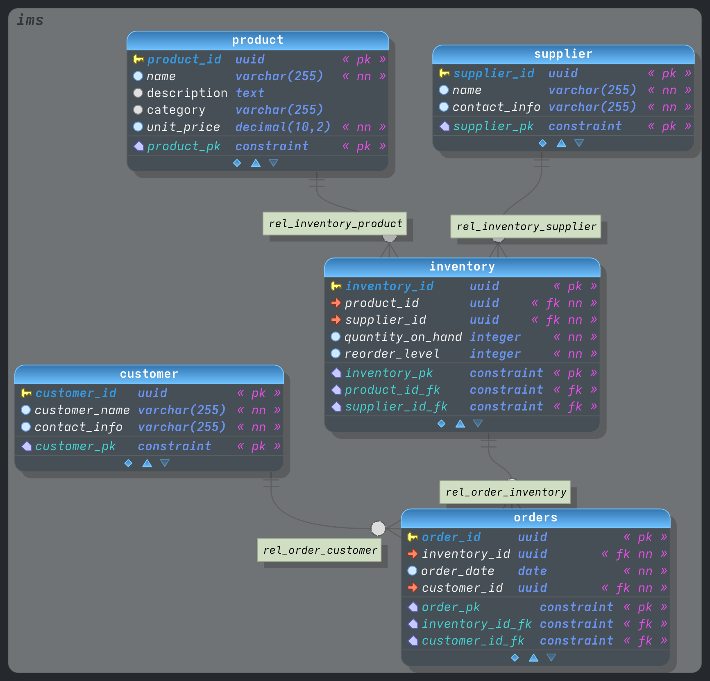
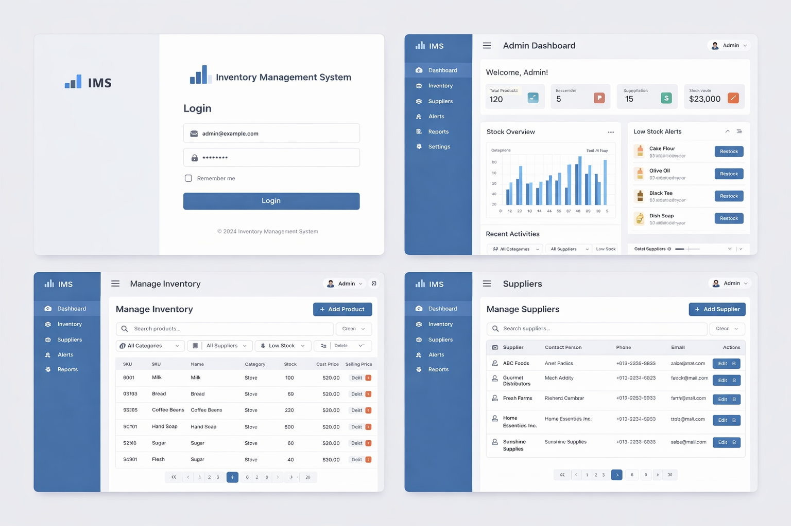

# 📊 IMS - Inventory Management System

A modern, full-stack Inventory Management System built with React and Node.js.




## ✨ Features

- **🔐 Login System** - Secure authentication with session management
- **📈 Dashboard** - Real-time stats for products, stock levels, suppliers, and stock value
- **📦 Inventory Management** - View and manage all inventory items with stock tracking
- **🏢 Supplier Management** - Maintain supplier directory with contact information
- **⚠️ Low Stock Alerts** - Automatic detection of items below reorder level

## 🚶 Project Walkthrough

Explore the core functionality of IMS through this step-by-step guide.

### 1. 🔐 Authentication
Begin by logging in with the administrative credentials. The system uses a secure mock authentication flow to ensure only authorized users access the inventory data.
- **Goal**: Access the secure dashboard.
- **Action**: Enter email `admin@example.com` and password `password`.

### 2. 📊 The Command Center (Dashboard)
Once authenticated, you are greeted by the Dashboard. This is your high-level overview of the entire operation.
- **Insights**: Monitor total product count, identify items needing immediate attention (Low Stock), see your supplier base size, and track the total valuation of your stock.
- **Visuals**: Interactive charts provide a breakdown of stock levels and categories.

### 3. 📦 Inventory Control
Navigate to the Inventory page to manage your assets.
- **View**: A comprehensive table showing all products, their categories, current stock levels, and unit prices.
- **Action**: Click "Add Inventory" to register new products. The system automatically calculates stock value and monitors the reorder level.

### 4. 🏢 Supplier Network
Maintain your relationships with the Suppliers page.
- **Directory**: View all registered suppliers and their contact information.
- **Action**: Add new suppliers to expand your sourcing capabilities. Each inventory item is linked back to a specific supplier for better traceability.

### 5. 🌑 Precision Curator Theme
The entire interface is wrapped in a high-tech "Precision Curator" dark mode, designed for reduced eye strain and a premium aesthetic.

## 🛠️ Tech Stack

### Frontend
- **React 18** - UI library
- **React Router v6** - Client-side routing
- **Vite** - Build tool and dev server

### Backend
- **Node.js** - Runtime environment
- **Express.js** - Web framework
- **SQLite** - Database (with schema based on PostgreSQL design)

## 🚀 Getting Started

### Prerequisites
- Node.js 18+ installed
- npm or yarn

### Installation

1. **Clone the repository**
   ```bash
   git clone https://github.com/NamTheGreat/IMS.git
   cd IMS
   ```

2. **Install Backend Dependencies**
   ```bash
   cd server
   npm install
   ```

3. **Install Frontend Dependencies**
   ```bash
   cd ../client
   npm install
   ```

### Running the Application

1. **Start the Backend** (runs on port 3000)
   ```bash
   cd server
   node index.js
   ```

2. **Start the Frontend** (runs on port 5173)
   ```bash
   cd client
   npm run dev
   ```

3. **Open your browser** at `http://localhost:5173`

### Default Login
- **Email**: `admin@example.com`
- **Password**: `password`

## 📁 Project Structure

```
IMS/
├── client/                 # React Frontend
│   ├── src/
│   │   ├── App.jsx        # Main app with routing
│   │   ├── main.jsx       # Entry point
│   │   └── index.css      # Global styles
│   ├── package.json
│   └── vite.config.js
│
├── server/                 # Node.js Backend
│   ├── index.js           # Express server & API routes
│   ├── db.js              # SQLite database connection
│   ├── schema.sql         # Database schema
│   └── package.json
│
├── db/                     # Database design files
│   ├── schema.dbm         # pgModeler file
│   └── schemaInit.sql     # PostgreSQL schema
│
└── assets/                 # Images and diagrams
    ├── ERD.png
    └── UI.png
```

## 🔌 API Endpoints

| Method | Endpoint | Description |
|--------|----------|-------------|
| POST | `/api/login` | Authenticate user |
| GET | `/api/dashboard` | Get dashboard statistics |
| GET | `/api/inventory` | List all inventory items |
| GET | `/api/suppliers` | List all suppliers |

## 📊 Database Schema

The system uses the following main tables:
- **product** - Product catalog with name, description, category, and price
- **supplier** - Supplier information with contact details
- **inventory** - Stock tracking linking products and suppliers
- **orders** - Order records
- **customer** - Customer information

## 📄 License

This project is for educational purposes.

---

Made with ❤️ for Inventory Management
